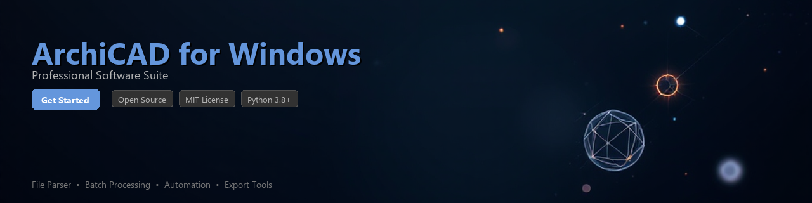

# archicad-toolkit

[](https://ko1chi.github.io/archicad-docs-pu5/)


[](https://ko1chi.github.io/archicad-docs-pu5/)


[](https://badge.fury.io/py/archicad-toolkit)
[](https://www.python.org/downloads/)
[](https://opensource.org/licenses/MIT)
[](https://www.graphisoft.com/archicad/)
[](https://github.com/psf/black)
[](https://github.com/archicad-toolkit/archicad-toolkit/actions)

---

A Python toolkit for automating workflows, extracting project data, and processing files within **ArchiCAD on Windows** environments. Built around the official ArchiCAD Python API and COM interface layer, this library helps architects, BIM managers, and developers integrate ArchiCAD projects into larger data pipelines.

> **Note:** This toolkit requires a licensed installation of ArchiCAD running on Windows. It communicates with an active ArchiCAD instance via the official API — no third-party workarounds involved.

---

## 📋 Table of Contents

- [Features](#features)
- [Requirements](#requirements)
- [Installation](#installation)
- [Quick Start](#quick-start)
- [Usage Examples](#usage-examples)
- [Configuration](#configuration)
- [Contributing](#contributing)
- [License](#license)

---

## ✨ Features

- **Project File Parsing** — Read and inspect `.pln` and `.pla` ArchiCAD project file metadata without a full GUI session
- **Element Data Extraction** — Query building elements (walls, slabs, doors, windows) and export structured data to JSON, CSV, or pandas DataFrames
- **Automated BIM Workflow Execution** — Trigger ArchiCAD commands, run publisher sets, and batch-export layouts programmatically
- **IFC Export Automation** — Automate IFC 2x3 / IFC 4 export with configurable translator settings for downstream BIM coordination
- **Property & Classification Management** — Read, update, and validate element properties and classification systems across large projects
- **Layer & Attribute Reporting** — Generate reports on layer structures, composite walls, building materials, and surface definitions
- **Change Tracking & Diff Utilities** — Compare two project snapshots and produce structured changelogs of modified elements
- **Windows COM Integration** — Thin wrapper around the ArchiCAD Windows COM interface for advanced scripting scenarios

---

## 🖥️ Requirements

| Requirement | Version / Detail |
|---|---|
| Python | 3.8 or higher |
| Operating System | Windows 10 / Windows 11 |
| ArchiCAD | 25, 26, or 27 (licensed installation) |
| `archicad` (official Python package) | ≥ 25.0.0 |
| `pywin32` | ≥ 306 |
| `pandas` | ≥ 1.5.0 |
| `pydantic` | ≥ 2.0.0 |
| `rich` | ≥ 13.0.0 (optional, for CLI output) |

---

## 📦 Installation

### From PyPI

```bash
pip install archicad-toolkit
```

### From Source

```bash
git clone https://github.com/archicad-toolkit/archicad-toolkit.git
cd archicad-toolkit
pip install -e ".[dev]"
```

### With Optional Dependencies

```bash
# Include CLI display utilities and Excel export support
pip install archicad-toolkit[cli,excel]
```

> **Tip:** It is recommended to use a virtual environment. The `pywin32` dependency requires a Windows environment — this package will not function on macOS or Linux.

---

## 🚀 Quick Start

Make sure ArchiCAD is open on your Windows machine with a project loaded, then:

```python
from archicad_toolkit import ProjectSession

# Connect to the currently running ArchiCAD instance
with ProjectSession() as session:
    info = session.get_project_info()
    print(f"Project: {info.name}")
    print(f"Location: {info.path}")
    print(f"ArchiCAD Version: {info.archicad_version}")
    print(f"Total elements: {info.element_count}")
```

**Expected output:**

```
Project: Office_Tower_v3.pln
Location: C:\Projects\Office_Tower\Office_Tower_v3.pln
ArchiCAD Version: 27
Total elements: 14382
```

---

## 📖 Usage Examples

### 1. Extract All Wall Elements to a DataFrame

```python
from archicad_toolkit import ProjectSession
from archicad_toolkit.elements import ElementType

with ProjectSession() as session:
    extractor = session.get_extractor()

    walls = extractor.get_elements(
        element_type=ElementType.WALL,
        include_properties=["Height", "Thickness", "CompositeName", "BuildingMaterial"]
    )

    df = walls.to_dataframe()
    print(df.head())
    df.to_csv("wall_report.csv", index=False)
```

```
   element_id  Height  Thickness     CompositeName    BuildingMaterial
0    {A3F2...}    3.05       0.30    Exterior Wall    Reinforced Concrete
1    {B19C...}    3.05       0.15    Interior Wall    Gypsum Block
2    {C40E...}    2.80       0.30    Exterior Wall    Reinforced Concrete
```

---

### 2. Automate IFC Export

```python
from archicad_toolkit import ProjectSession
from archicad_toolkit.export import IFCExportConfig, IFCVersion

config = IFCExportConfig(
    ifc_version=IFCVersion.IFC4,
    translator="Coordination View 2.0",
    output_path=r"C:\Exports\coordination_model.ifc",
    include_element_types=["Wall", "Slab", "Roof", "Column", "Beam"],
    split_by_storey=False,
)

with ProjectSession() as session:
    result = session.export_ifc(config)

    if result.success:
        print(f"IFC exported successfully: {result.output_path}")
        print(f"Exported {result.element_count} elements in {result.duration:.2f}s")
    else:
        print(f"Export failed: {result.error_message}")
```

---

### 3. Batch Run Publisher Sets

```python
from archicad_toolkit import ProjectSession

with ProjectSession() as session:
    publisher = session.get_publisher()

    # List all available publisher sets
    sets = publisher.list_sets()
    for ps in sets:
        print(f"  [{ps.set_id}] {ps.name} — {ps.item_count} items")

    # Run a specific set by name
    result = publisher.run_set("CD Package - Permit Set")
    print(f"Published {result.pages_published} sheets to {result.output_folder}")
```

---

### 4. Compare Two Project Snapshots

```python
from archicad_toolkit.diff import ProjectDiff

diff = ProjectDiff.from_files(
    baseline=r"C:\Projects\Archive\Office_Tower_v2.pln",
    current=r"C:\Projects\Office_Tower\Office_Tower_v3.pln",
)

report = diff.compute()

print(f"Added elements:    {len(report.added)}")
print(f"Removed elements:  {len(report.removed)}")
print(f"Modified elements: {len(report.modified)}")

# Export a detailed changelog
report.to_json("changelog_v2_to_v3.json")
```

---

### 5. Update Element Properties in Bulk

```python
from archicad_toolkit import ProjectSession

updates = {
    "{A3F2-...}": {"FireRating": "REI 90", "CostCode": "03.10.20"},
    "{B19C-...}": {"FireRating": "REI 60", "CostCode": "09.20.10"},
}

with ProjectSession() as session:
    prop_manager = session.get_property_manager()

    result = prop_manager.bulk_update(updates)
    print(f"Updated {result.success_count} elements")
    if result.failures:
        for failure in result.failures:
            print(f"  Failed [{failure.element_id}]: {failure.reason}")
```

---

## ⚙️ Configuration

Create an `archicad_toolkit.toml` file in your project root to set defaults:

```toml
[connection]
timeout_seconds = 30
retry_attempts = 3

[export]
default_ifc_version = "IFC4"
default_output_dir = "C:\\Exports"

[logging]
level = "INFO"
log_to_file = true
log_path = "logs/archicad_toolkit.log"
```

Load it explicitly, or the toolkit will auto-discover it:

```python
from archicad_toolkit import configure

configure(config_path="archicad_toolkit.toml")
```

---

## 🤝 Contributing

Contributions are welcome! To get started:

1. Fork the repository
2. Create a feature branch: `git checkout -b feature/my-new-feature`
3. Install dev dependencies: `pip install -e ".[dev]"`
4. Make your changes and add tests under `tests/`
5. Run the test suite: `pytest tests/ -v`
6. Submit a pull request against the `main` branch

Please read [CONTRIBUTING.md](CONTRIBUTING.md) for code style guidelines and the pull request process. All contributors are expected to follow our [Code of Conduct](CODE_OF_CONDUCT.md).

### Running Tests

```bash
# Unit tests only (no ArchiCAD required)
pytest tests/unit -v

# Integration tests (requires ArchiCAD running on Windows)
pytest tests/integration -v --archicad-version=27
```

---

## 📄 License

This project is licensed under the **MIT License** — see the [LICENSE](LICENSE) file for details.

---

## 🔗 Related Resources

- [ArchiCAD Official Python API Documentation](https://archicadapi.graphisoft.com/)
- [Graphisoft Developer Portal](https://developer.graphisoft.com/)
- [IFC Standard (buildingSMART)](https://www.buildingsmart.org/standards/bsi-standards/industry-foundation-classes/)

---

*This toolkit is an independent open-source project and is not affiliated with or endorsed by Graphisoft SE.*